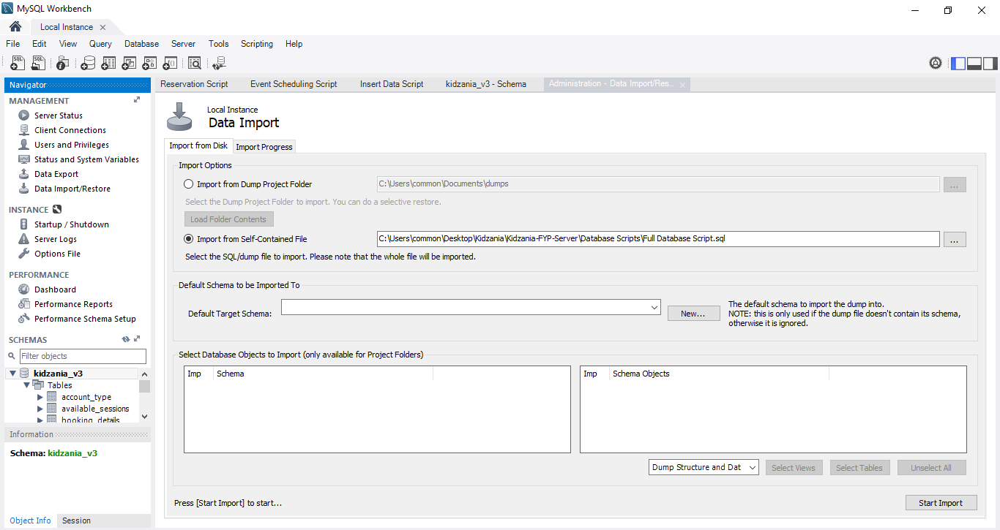
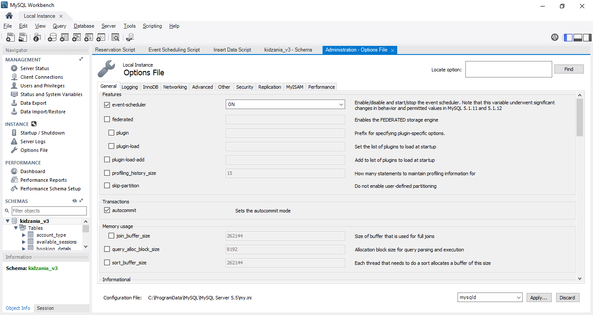
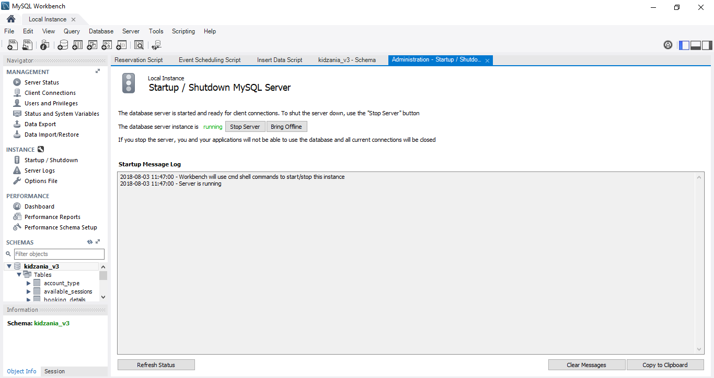

# Q-zee Backend Server
Backend Server of the queue management system. This includes a Node.js server-side application and the MySQL database used to power both the Administrative portal and User Booking Portal. Click here to find out more about the Administrative Portal [https://github.com/jjlim7-16/Admin-Nuxt] and User Booking Portal [https://github.com/Syoongy/kidzania-fyp-client]

## Project File Structure
```bash
├── Database Scripts          # Database Scripts Directory
├── Images                    # Image Directory
├── Routes                    # API Routes Directory
│   ├── accountRouter.js      # User Accounts API
│   ├── bookingRouter.js      # Booking Details API
│   ├── dashboardRouter.js    # Dashboard Metrics API
│   ├── limitRouter.js        # Booking Limits API
│   ├── reservationRouter.js  # VIP Reservations API
│   ├── roleRouter.js         # Roles API
│   ├── sessionRouter.js      # Role-playing Sessions API
│   └── stationRouter.js      # Stations API
|
└── Src                       # Startup Directory
    ├── app.js                # Server Startup
    ├── auth.js               # Authentication API
    ├── config.js             # Server Configuration
    ├── dashboard.js          # Socket-Dashboard API
    ├── databasePool.js       # Database Pool Connection
    ├── passport.js           # Configuration for Passport Authentication
    └── seedData.js           # Generation of Sessions Data Functions  
```

## Pre-Requisites
* Install MySQL Community Server v5.7 (Full)
* Install Git
* Install Node.js v8.11.3

```bash
# Open Command Line or Powershell to run these commands

# Install yarn
$ npm i -g yarn

# Clone Github Repository of Backend Server
$ git clone https://github.com/jjlim7-16/Kidzania-FYP-Server.git
```

## MySQL Database Setup
1. Run MySQL Workbench as Administrator (Right-click on MySQL Workbench and select **Run as Administrator**)

2. Import Database Script by navigating to the Data Import Page. Select the 'Import from Self-Contained File' option and upload the Database Script file located in the Project Folder

    

3. Navigate to Options File; Activate event Scheduler (ON)

    

4. Navigate to Startup/Shutdown. Ensure the server is **started**.

    

## Network Configuration

1. Navigate to Control Panel **>** Network and Internet **>** Network and Sharing Center

2. Select **Change adapter settings**

3. Right-click on **Local Area Connection** and click on **Properties**

4. Select **Internet Protocol Version 4 (TCP/IPv4)** and click on **Properties**

5. Choose to set the IP Address & DNS Server Address **manually**.

## Deploy Server
**Navigate to the project folder & open command line or powershell**
```bash
# Build & Run Server In Production Mode
$ yarn deploy
```

=======
* Database Scripts: Contains scripts to be ran or imported to setup the databae
* Images: Where all images of stations/roles are stored
* Routes: Handles the routing of various APIs

	`| StationRouter.js` - 
* Src: Holds the 

## Setup & Installation

* Install MySQL Community Server v5.7 (Full) - https://dev.mysql.com/downloads/mysql/
* Install Git - https://git-scm.com/downloads
* Install Node.js v8.11.3 - https://nodejs.org/en/download/
* Install Yarn from CLI:
	```bash 
	$ npm i -g yarn
	```

## Setting Up MySQL Database
* Run MySQL Workbench as Administrator
* Import database script located in 'Database Script' Folder
* Run script: `SET GLOBAL EVENT_SCHEDULER = ON;`
* Ensure correct setting of username, password, and database in the */src/databasePool.js* file

## Network Configuration
* Navigate to Control Panel Network Settings and view the properties of the network the machine is currently on.

* Set Static IP Address by setting

## Deployment
```bash
# Clone project from Github Repository
$ git clone 'https://github.com/jjlim7-16/Kidzania-FYP-Server/'

# Install dependencies
$ yarn install

# Set Environment to Production mode
$ SET NODE_ENV=production

# Deploy Server
$ yarn deploy
```

For more details, or if any bugs are found, please contact...
